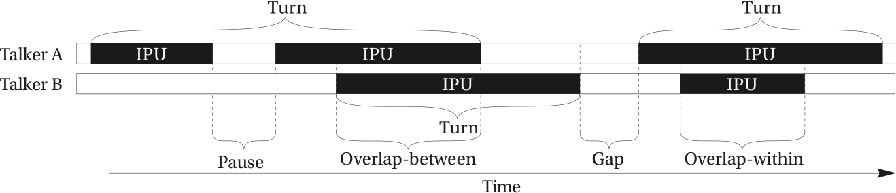

# Conversational Dynamics Classifier

This algorithm classifies conversations between people into **conversational dynamics** by detecting and categorizing communicative states such as gaps, overlaps, pauses, and inter-pausal units.

It takes audio waveforms from 2–4 talkers and performs two main steps:

1. **Voice Activity Detection (VAD)**: Converts raw audio into binary activity arrays per speaker.
2. **Communicative State Classification (CSC)**: Uses a finite state machine (FSM) to classify the conversational dynamics frame-by-frame.

## Voice Activity Detection (VAD)
The VAD module converts raw audio into binary activity arrays per speaker. It uses an energy-based approach with the following steps:

- The waveform is buffered into overlapping windows of 5 ms with 1 ms overlap, resulting in a temporal resolution of 4 ms.
- The squared RMS value is computed for each window.
- A threshold is applied to classify each window as speech (1) or silence (0).
- Two post-processing steps are applied:
  - Bridging gaps < 180 ms to avoid misclassifying stop consonants as pauses.
  - Removing bursts < 90 ms to eliminate clicks and pops.

The result is a Voice Activity Indication (VAI) array for each speaker, which is passed to the CSC algorithm.

## Communicative State Classification (CSC)

The CSC algorithm operates on a **frame-by-frame basis**, enabling **on-the-fly classification**. This makes it suitable for real-time or field applications where only conversational dynamics (not audio content) are stored.

The FSM evaluates combinations of active/inactive speakers and detects transitions between states. These transitions are used to classify:

- **Gaps**: Silence between the end of one speaker’s utterance and the beginning of the next speaker’s utterance. Gaps are positive floor-transfer offsets (FTOs).
- **Overlaps-between**: The next speaker starts before the previous finishes (negative FTOs).
- **Overlaps-within**: A speaker produces speech entirely within another speaker's utterance.
- **Pauses**: Silences within a speaker’s own speech stream, not interrupted by others.
- **Inter-pausal units (IPUs)**: Sequences of words surrounded by silence, excluding overlaps-within.
- **Turns:** Measured from the onset of the IPU following a floor-transfer to the offset of the IPU before next floor-transfer.

For four speakers, the FSM evaluates all 16 possible combinations of activity states (2⁴). Each speaker maintains its own state history and timing markers to compute durations. The output consists of arrays of onsets, offsets, and durations for each communicative category.

   
  <em>Figure 1. Classification of conversational dynamics. Figure taken from Figure 2.2 on p. 18 in my PhD thesis [2].</em>

For an overview of the nomenclature, please refer to my PhD thesis:  
[1] Sørensen, A. Josefine Munch. 2021. *The Effects of Noise and Hearing Loss on Conversational Dynamics.* DTU Health Technology. https://findit.dtu.dk/en/catalog/615d73b4d9001d0143799332  

---
## Tutorial
`tutorial/tutorial_CSC.m` will guide you through how to run the VAD and CSC, based on the functions in the `tools` folder, on an example of a conversation taken from:
[2] Sørensen, Anna Josefine, Fereczkowski, Michal, & MacDonald, Ewen Neale. (2018, March 21). "Task dialog by native-Danish talkers in Danish and English in both quiet and noise." Zenodo. https://doi.org/10.5281/zenodo.1204951.

---

## How to cite

If you use this repository, please cite it as:

Anna Josefine Munch Sørensen. (2025). *Communicative State Classification: MATLAB algorithm for classifying multi-talker audio into timings and durations of conversational dynamics* (Version 1.0.0) [Computer software]. https://doi.org/10.5281/zenodo.17063065

---
**Note:** The functions `determineStartCH.m` and `channelTurn.m` need the `bi2de` and `de2bi` functions from the Communications Toolbox in MATLAB. If you do not have access to that toolbox, you need to write a function that converts a decimal to a binary array and vice versa. In a future commit, these functions will be added to the `tools` folder.

For questions, please contact me at annajosefine@gmail.com.
